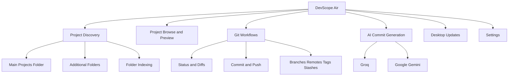
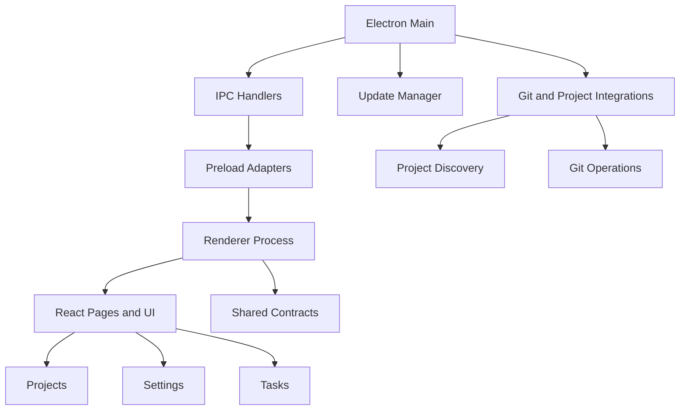

<div align="center">
  <pre>
 ██████╗ ███████╗██╗   ██╗███████╗ ██████╗ ██████╗ ██████╗ ███████╗
 ██╔══██╗██╔════╝██║   ██║██╔════╝██╔════╝██╔═══██╗██╔══██╗██╔════╝
██║  ██║█████╗  ██║   ██║███████╗██║     ██║   ██║██████╔╝█████╗
██║  ██║██╔══╝  ╚██╗ ██╔╝╚════██║██║     ██║   ██║██╔═══╝ ██╔══╝
 ██████╔╝███████╗ ╚████╔╝ ███████║╚██████╗╚██████╔╝██║     ███████╗
 ╚═════╝ ╚══════╝  ╚═══╝  ╚══════╝ ╚═════╝ ╚═════╝ ╚═╝     ╚══════╝
  </pre>
</div>

<h1 align="center">DevScope Air</h1>

<p align="center">
  <strong>Projects-First Developer Workspace for Windows</strong>
</p>

<p align="center">
  <a href="https://github.com/justelson/dev_scope">
    
  </a>
  
  
  
</p>

<p align="center">
  
  
  
  
  
</p>

---

## Overview

> **Primary Desktop App**
> This repository root is the active Windows desktop codebase for DevScope Air.
> The older `devscope-win` implementation is not the active app and older work remains only in git history or archive folders.

DevScope Air is the main Windows Electron app in this repository. It is built around local project discovery, project browsing, file preview, Git workflows, app settings, and release update flows from one desktop surface.

The current package is [`devscope-air-win`](./package.json), currently version `1.1.0-alpha.3`.

## Key Features

| Feature | Description |
| :--- | :--- |
| **Project Discovery** | Scan a main projects root plus additional folders and index projects across multiple local locations. |
| **Project Browsing** | Browse folders, inspect project details, and preview files without leaving the app shell. |
| **Git Productivity** | View status, diffs, history, branches, remotes, stashes, tags, commits, push state, and repository setup actions. |
| **AI Commit Assistant** | Generate commit messages through Groq or Google Gemini from the app's Git-oriented flows. |
| **Desktop Updates** | Check, download, and install release updates through the built-in updater flow. |
| **Settings Surface** | Configure appearance, behavior, projects, AI, terminal preferences, logs, and app metadata. |

## Capability Map



## Air Build Notes

DevScope Air intentionally keeps some capability surfaces disabled in this build:

- **AI Runtime Status** is disabled in Air.
- **AgentScope session tooling** is disabled in Air.
- The app still contains a broad shared tool registry, but not every historical surface is exposed in the current Air UI.

## Technology Stack

DevScope Air is built with a Windows-first desktop stack:

- **Desktop Shell**: [Electron](https://www.electronjs.org/) with [`electron-vite`](https://electron-vite.org/)
- **Frontend**: [React](https://react.dev/) 19 + [TypeScript](https://www.typescriptlang.org/) + [Tailwind CSS](https://tailwindcss.com/)
- **Renderer Routing**: [React Router](https://reactrouter.com/)
- **Editor/Preview Tooling**: Monaco-based file preview support
- **AI Integration**: Groq and Google Gemini for commit message generation
- **Desktop Packaging**: `electron-builder`

## Getting Started

### Prerequisites

- **Node.js**: v18 or higher
- **npm**: v9 or higher
- **Windows 10/11**: primary supported target

### Installation

1. Clone the repository:
   ```bash
   git clone https://github.com/justelson/dev_scope.git
   cd devscope
   ```

2. Install dependencies:
   ```bash
   npm install
   ```

### Running in Development

```bash
npm run dev
```

### Type Checking

```bash
npm run typecheck
```

### Building for Production

```bash
npm run build
```

### Packaging for Windows

```bash
npm run build:win
```

Packaged installers and update metadata are written to `dist/releases/v<package-version>/`.
Unpacked desktop bundles are written to `dist/unpacked/v<package-version>/win-unpacked/`.
Use `npm run dist:organize` to move older flat `dist` artifacts into that versioned layout.

## Project Structure



## Repository Areas

- [`src/main`](./src/main): Electron main process, IPC registration, update logic, Git and project handlers.
- [`src/preload`](./src/preload): renderer bridge adapters and disabled-feature adapters.
- [`src/renderer/src`](./src/renderer/src): React app shell, pages, layouts, and UI components.
- [`src/shared`](./src/shared): contracts, shared metrics, and tool-registry definitions.
- [`apps/landing/devscope-web`](./apps/landing/devscope-web): separate landing-site package.

## Contributing

Contributions are welcome, especially around project workflows, Git UX, desktop polish, and Windows-focused developer tooling.

1. Fork the project
2. Create your branch: `git checkout -b feature/your-change`
3. Commit your changes
4. Push the branch
5. Open a pull request

## Acknowledgements

- DevScope repository: [justelson/dev_scope](https://github.com/justelson/dev_scope)
- Sparkle design origin: [thedogecraft/sparkle](https://github.com/thedogecraft/sparkle)

The Sparkle-inspired visual direction used in this repository was originally derived from that Sparkle project, then adapted to DevScope's own product structure and behaviors.

## License

Distributed under the MIT License. See [`package.json`](./package.json) for the current package metadata.

## Repository Notes

- The repository root is the primary desktop app and release target.
- The landing package has its own README at [`apps/landing/devscope-web/README.md`](./apps/landing/devscope-web/README.md).
- Historical legacy work remains accessible through git history and archive folders.

---

<p align="center">
  Built for Windows developers who want project context and Git workflow in one place.
</p>

---

# Devs don't use light mode.
