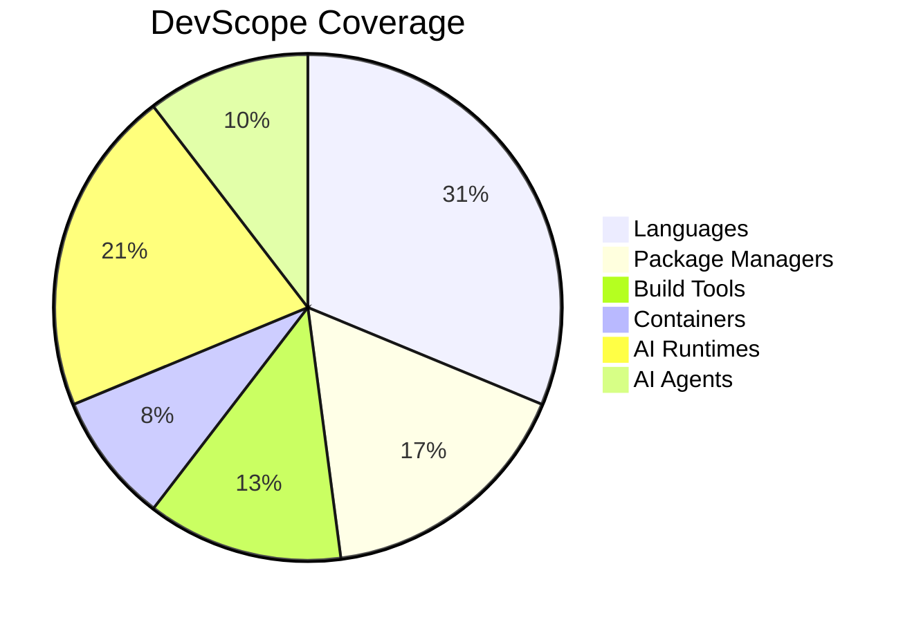
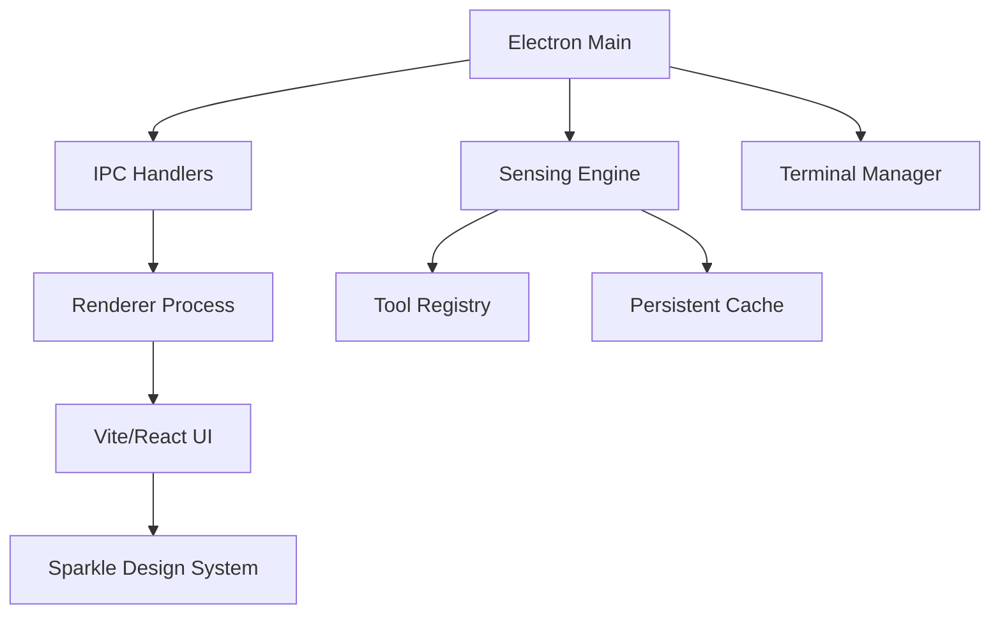

<div align="center">
  <pre>
    ██
 ██████╗ ███████╗██╗   ██╗███████╗ ██████╗ ██████╗ ██████╗ ███████╗
 ██╔══██╗██╔════╝██║   ██║██╔════╝██╔════╝██╔═══██╗██╔══██╗██╔════╝
 ██║  ██║█████╗  ██║   ██║███████╗██║     ██║   ██║██████╔╝█████╗  
 ██║  ██║██╔══╝  ╚██╗ ██╔╝╚════██║██║     ██║   ██║██╔═══╝ ██╔══╝  
 ██████╔╝███████╗ ╚████╔╝ ███████║╚██████╗╚██████╔╝██║     ███████╗
 ╚═════╝ ╚══════╝  ╚═══╝  ╚══════╝ ╚═════╝ ╚═════╝ ╚═╝     ╚══════╝
  </pre>
</div>

<h1 align="center">DevScope Air</h1>

<p align="center">
  <strong>Projects-First Developer Workspace for Windows</strong>
</p>

<p align="center">
    
</p>

---

## Overview

> **Air Variant Note**
> This build focuses on Projects workflows (scan, browse, details, Git, commit-assist)
> and removes in-app Terminal and Agent orchestration surfaces.
DevScope Air is a projects-focused Windows Electron app that gives developers a clear view of local projects, tooling, and Git status. It keeps the DevScope desktop architecture while excluding AgentScope and integrated terminal features.

Mainly targeted for Windows developers, DevScope eliminates the "fragmented environment" problem by providing a single source of truth for your developer stack.

## Key Features

| Feature | Description |
| :--- | :--- |
| **Unified Tool Sensing** | Automatically detects 50+ developer tools (Languages, Package Managers, Build Tools, Containers, Version Control). |
| **AI Runtime Discovery** | Deep-scans for Ollama, CUDA, Jan, LM Studio, and other local LLM runtimes. |
| **Projects Workflows** | Deep project scanning, folder browsing, file preview, and repository insights. |
| **AI Commit Assistant** | Integrated Groq-powered AI that generates detailed, conventional commit messages based on your diffs. |
| **Git Productivity** | Commit history, diffs, staging, commit/push, and repo initialization utilities. |
| **Modern Aesthetics** | A high-end UI built with the Sparkle Design System, featuring glassmorphism and smooth animations. |

## Supported Tool Categories



## Technology Stack

DevScope is built with a focus on performance and native Windows integration:

- **Frontend**: Vite + React + Tailwind CSS
- **Backend**: Electron (Main Process)
- **Design Core**: Sparkle Design System (Vanilla CSS + Custom Components)
- **AI Integration**: Groq API (Llama 3.1 8B Instant)
- **Sensing Engine**: Strategy-based Node.js engine with CLI, Process, and Custom Detectors

## Getting Started

### Prerequisites

- **Node.js**: v18.x or higher
- **npm**: v9.x or higher (or **Bun** v1.0+)
- **Windows 10/11**: (Current primary target)

### Installation

1. Clone the repository:
   ```bash
   git clone https://github.com/elsonmgaya/devscope.git
   cd devscope-win
   ```

2. Install dependencies:
   ```bash
   npm install
   ```
   or
   ```bash
   bun install
   ```

### Running in Development

```bash
npm run dev
```
or
```bash
bun run dev
```

### Building for Production

```bash
npm run build
```
or
```bash
bun run build
```

## Project Structure



## Contributing

We welcome contributions! If you're a developer looking to improve tool detection or enhance the UI, feel free to submit a Pull Request.

1. Fork the Project
2. Create your Feature Branch (`git checkout -b feature/AmazingFeature`)
3. Commit your Changes (`git commit -m 'Add some AmazingFeature'`)
4. Push to the Branch (`git checkout origin feature/AmazingFeature`)
5. Open a Pull Request

## Acknowledgements

Special thanks to the [Sparkle Design System](https://github.com/sparkle-design-system) for the UI framework and design inspiration that powers DevScope's modern aesthetic.

## License

Distributed under the MIT License. See `LICENSE` for more information.

---

<p align="center">
  Built with ❤️ for the developer community. By the developer community.
</p>


